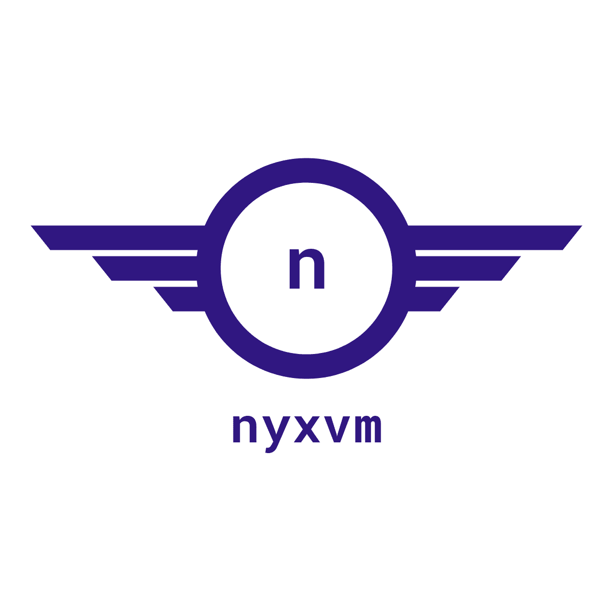

This project extends [nyx](https://github.com/kelthuzadx/nyx). Instead of an AST based interpreter, **nyxvm** transforms
AST to bytecode, and interprets bytecode on VM.

# Documentation
+ [Bytecode reference](doc/bytecode.md)
+ [Builtin functions](doc/builtin.md)

# License
All code licensed under the [MIT License](LICENSE). Note that during the development, license is subject to change without further notifications.